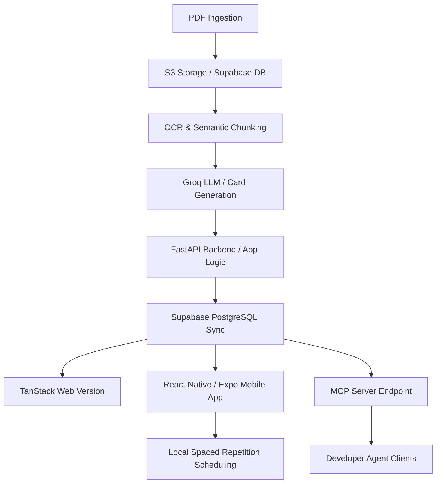

# ⚡ PikaDecks

[](https://opensource.org/licenses/MIT)
[](#)
[](#)

PikaDecks is a complete, AI-powered learning and knowledge retention platform. Unlike traditional simple flashcard apps, PikaDecks implements a unified model for automated document ingestion, OCR parsing, semantic chunking, dynamic flashcard generation, and Spaced Repetition System (SRS) scheduling, keeping web clients, mobile apps, and developer agents in sync.

---

## 📌 Table of Contents

- [🚀 Quick Start (Under 10 Minutes)](#-quick-start-under-10-minutes)
- [📂 Repository Directory Structure](#-repository-directory-structure)
- [🏛️ System & Data Flow Architecture](#%EF%B8%8F-system--data-flow-architecture)
- [🤖 How AI Accelerated Development](#-how-ai-accelerated-development)
- [🧠 Why Codex & GPT-5.6](#-why-codex--gpt-56)
- [🔌 Model Context Protocol (MCP) Server](#-model-context-protocol-mcp-server)
- [⚙️ Sub-Service Setup Guides](#%EF%B8%8F-sub-service-setup-guides)
  - [1. Backend (FastAPI)](#1-backend-fastapi)
  - [2. Website (TanStack Start + Vite)](#2-website-tanstack-start--vite)
  - [3. Mobile App (React Native + Expo)](#3-mobile-app-react-native--expo)
  - [4. MCP Server (Python FastMCP)](#4-mcp-server-python-fastmcp)
- [🔑 Environment Variables](#-environment-variables)
- [📼 Demo Video](#-demo-video)
- [⚖️ License](#%EF%B8%8F-license)

---

## 🚀 Quick Start (Under 10 Minutes)

To run the entire ecosystem locally for judging and verification without manual setups:

1. **Prerequisites**: Make sure you have Node.js (v18+), Python (3.10+), and Docker installed.
2. **Clone the Repo & Root Install**:
   ```bash
   git clone https://github.com/your-username/pikadecks.git
   cd pikadecks
   ```
3. **Run the Backend (FastAPI)**:
   ```bash
   cd pikadecks-backend
   python -m venv pikavenv
   # On Windows:
   .\pikavenv\Scripts\activate
   # On macOS/Linux:
   source pikavenv/bin/activate
   pip install -r requirements.txt
   uvicorn app.main:app --reload --port 8000
   ```
4. **Run the Web Application**:
   ```bash
   cd ../webversion
   npm install
   npm run dev
   ```
   Open `http://localhost:3000` to interact with the web interface.
5. **Run the MCP Server (Interactive Testing)**:
   ```bash
   cd ../pikadecks-mcp
   pip install -r requirements.txt
   uvicorn app.main:app --reload --port 8080
   ```

---

## 📂 Repository Directory Structure

The PikaDecks project is organized as a monorepo consisting of the following key directories:

```text
pikadecks/
├── docs/                        # Architectural documentation and visual assets
│   ├── architecture.md
│   ├── deployment.md
│   └── ai-development.md
├── pikadecks-backend/           # FastAPI core backend with SRS, S3, Supabase, and AI pipelines
├── pikadecks-mcp/               # FastMCP Server for developer agents / compatible LLM clients
├── pikadecks_frontend/          # Cross-platform Mobile App built with React Native & Expo
└── webversion/                  # High-performance web application (TanStack Start + React 19 + Vite)
```

---

## 🏛️ System & Data Flow Architecture

The data pipeline transitions from initial document ingestion all the way to localized mobile sync and SRS calculations:



### Deployed Services & MCP Edge Routing
The MCP server is deployed independently via AWS Lambda and API Gateway, proxied through Cloudflare/Vite Edge workers so that compatible clients (e.g. Claude Desktop, ChatGPT Custom GPTs) can query server status using:
```text
https://pikadecks.app/mcp
```

---

## 🤖 How AI Accelerated Development

This project was engineered using a collaborative developer-in-the-loop workflow, leveraging the strengths of three tiers of AI assistance:

* **ChatGPT**: Acted as the product manager and technical architect. It helped with initial database schema designs, brainstorming the Spaced Repetition algorithm variants, structuring the monorepo, and writing the underlying system prompts for AI card generation.
* **Codex (GPT-5.6)**: Worked as the implementation partner for the app. We used Codex to read the existing codebase, propose scoped changes, write backend and frontend code, add focused tests, debug failing builds, and explain tradeoffs before final human approval. It helped with PDF chunking logic, FastAPI routes, Expo navigation, web state hooks, MCP integration, and payment flow fixes.
* **Antigravity Agents**: Executed larger repository-wide refactoring workflows, multi-file code migrations, automated dependency audits, and managed background builds.

---

## 🧠 Why Codex & GPT-5.6

During this Build Week, Codex and GPT-5.6 accelerated our software engineering throughput significantly. We did not use Codex as a one-shot code generator; we used it through a feedback-driven development loop:

1. **Understand the task**: The human developer described the desired feature or bug fix, including expected behavior and app constraints.
2. **Inspect the codebase**: Codex searched the relevant backend, web, mobile, and MCP files before making changes.
3. **Implement a narrow change**: Codex edited only the files needed for the feature, following existing FastAPI, React, Expo, and TypeScript patterns.
4. **Run verification**: Codex ran type checks, builds, tests, or targeted local checks when available.
5. **Use feedback to refine**: The developer reviewed the result, gave feedback about UI behavior, copy clarity, API shape, or edge cases, and Codex revised the implementation until it matched the product expectation.
6. **Document the result**: Codex helped explain what changed, why it changed, and how the feature should be tested.

Key examples:

1. **Context-Aware Refactoring**: Codex digested complex, multi-file TypeScript codebases, including TanStack Start routes, and refactored state synchronization hooks such as `useStats` and `useDecks` without losing track of route and cache boundaries.
2. **Deterministic Code Generation**: For the Spaced Repetition algorithm (`srs.py`), Codex generated clean, type-safe Python logic following the SuperMemo-2 (SM2) scheduling parameters.
3. **Cross-Service Debugging**: Codex aligned FastAPI schemas, TypeScript interfaces, Expo screens, and payment-related backend routes so that the web app, mobile app, and API stayed consistent.
4. **Build and Deployment Feedback**: When Expo SDK mismatches, Serverless deployment problems, or frontend build errors appeared, Codex used the error output as feedback and iterated on the configuration or code until the checks passed.
5. **Product Copy and UX Polish**: Codex helped rewrite unclear messages, locked-feature text, support copy, and user-facing explanations so the app communicated what was happening instead of exposing raw technical errors.

### Codex Development Sessions

The following historical Codex development sessions represent the core technical milestones of the project:

* **`8c93aa7b-2342-48bd-80f9-b308d0ad1395`**
  * *Focus*: Built core website persistence, state synchronization components, and processing managers.
* **`0a5cc2c8-a5bf-4fd7-9159-1b4006206620`**
  * *Focus*: Unified data schemas across the FastAPI backend and React frontend.
* **`763b8d1b-aee3-424f-8bc6-50dccc795566`**
  * *Focus*: Implemented web subscription payments using Razorpay and Stripe.
* **`34d38411-4a1e-43bd-a774-643d3c4c3760`**
  * *Focus*: Integrated Model Context Protocol capabilities, limiting client tracking, and setting workspace constraints.

---

## 🔌 Model Context Protocol (MCP) Server

PikaDecks features a standalone **Model Context Protocol (MCP)** server built using the FastMCP framework.

### Why PikaDecks has an MCP Server
The MCP server exposes PikaDecks metadata and connectivity checks directly to AI agents. When a developer or a student uses an MCP-compatible AI client (like Claude Desktop or Cursor), the agent can communicate directly with the local/deployed PikaDecks database to inspect decks, check health status, or retrieve version numbers automatically.

### Supported Tools
* `ping`: Connectivity check returning response time and status.
* `get_server_info`: Retrieves current deployment stage and service statistics.
* `health_check`: Checks system integrations and uptime status.

---

## ⚙️ Sub-Service Setup Guides

### 1. Backend (FastAPI)
Located in `[pikadecks-backend](file:///d:/PikaDecks/pikadecks-backend)`.
- **Install Requirements**: `pip install -r requirements.txt`
- **Database Migrations**: Setup Supabase credentials and apply `schema.sql`.
- **Launch server**: `uvicorn app.main:app --port 8000`

### 2. Website (TanStack Start + Vite)
Located in `[webversion](file:///d:/PikaDecks/webversion)`.
- **Install Packages**: `npm install`
- **Run in Development**: `npm run dev`
- **Production Build**: `npm run build`

### 3. Mobile App (React Native + Expo)
Located in `[pikadecks_frontend](file:///d:/PikaDecks/pikadecks_frontend)`.
- **Install Packages**: `npm install`
- **Start Expo Metro Bundler**: `npx expo start`
- **Deploy to Emulator**: Press `a` for Android, `i` for iOS.

### 4. MCP Server (Python FastMCP)
Located in `[pikadecks-mcp](file:///d:/PikaDecks/pikadecks-mcp)`.
- **Run Locally**: `uvicorn app.main:app --port 8080`
- **Deploy via Serverless framework**: `serverless deploy --stage prod`

---

## 🔑 Environment Variables

Create `.env` files in each workspace subdirectory based on the following configurations:

#### Backend / MCP:
```env
SUPABASE_URL=your_supabase_url
SUPABASE_KEY=your_supabase_anon_key
GROQ_API_KEY=your_groq_api_key
S3_BUCKET_NAME=your_s3_bucket
AWS_ACCESS_KEY_ID=your_aws_key
AWS_SECRET_ACCESS_KEY=your_aws_secret
```

#### Web Application / Frontend:
```env
VITE_API_URL=http://localhost:8000
VITE_CLERK_PUBLISHABLE_KEY=your_clerk_key
VITE_STRIPE_PUBLISHABLE_KEY=your_stripe_key
```

---

## 📼 Demo Video

https://www.youtube.com/watch?v=SglX-F8cNJI
---

## ⚖️ License

Distributed under the MIT License. See `LICENSE` for more details.
