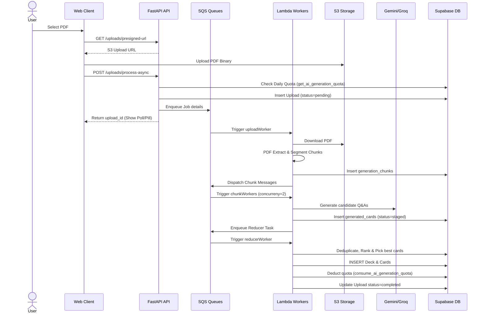
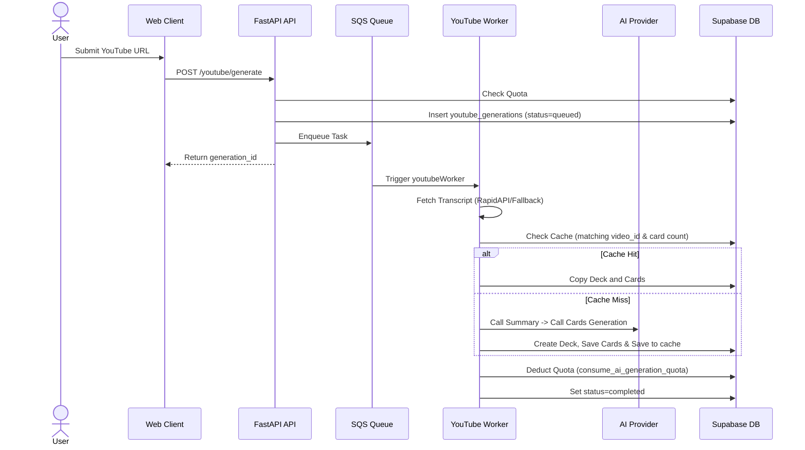
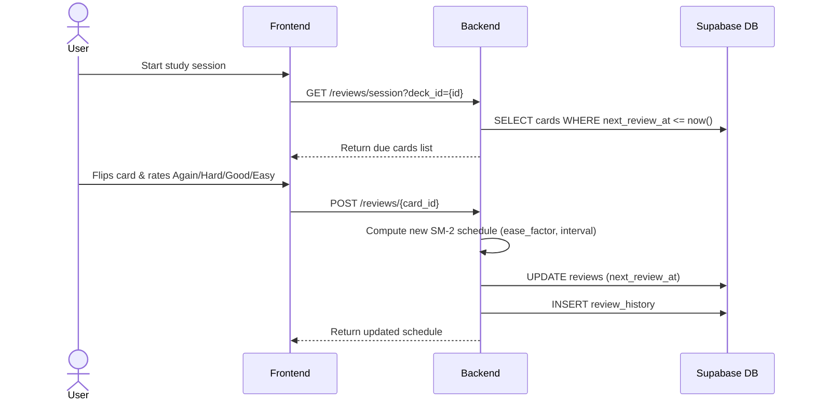

# PikaDecks Complete System Architecture & Documentation

This document provides an accurate, code-derived architectural description of the PikaDecks ecosystem, covering the React web application (`webversion`), Expo React Native mobile application (`pikadecks_frontend`), serverless backend REST API (`pikadecks-backend`), and FastMCP server (`pikadecks-mcp`).

---

## 1. High-Level System Context

PikaDecks is an AI-powered active recall flashcard generation and spaced repetition study tool. Users can upload study materials (PDF documents or YouTube links) or write manual notes, which are processed via an asynchronous AWS Lambda/SQS pipeline using Gemini and Groq AI models. Flashcard decks are studied using a SuperMemo-2 (SM-2) spaced repetition scheduler.

### PlantUML Source Diagrams
All diagrams are saved as separate files in the [architecture](file:///d:/PikaDecks/architecture/) directory:
* [System Context Diagram](file:///d:/PikaDecks/architecture/system_context.puml)
* [High-Level Container Diagram](file:///d:/PikaDecks/architecture/high_level_architecture.puml)
* [Deployment Node Layout](file:///d:/PikaDecks/architecture/deployment.puml)
* [AWS/Third-party Infrastructure Mapping](file:///d:/PikaDecks/architecture/infrastructure.puml)
* [Application Component Diagram](file:///d:/PikaDecks/architecture/component.puml)
* [Backend Package Layout](file:///d:/PikaDecks/architecture/package.puml)
* [Entity Relationship Diagram](file:///d:/PikaDecks/architecture/er_diagram.puml)
* [System Use Case Diagram](file:///d:/PikaDecks/architecture/use_case.puml)
* [CI/CD Deployment Flow](file:///d:/PikaDecks/architecture/cicd_pipeline.puml)

---

## 2. Infrastructure & Deployment Architecture

### AWS Cloud Infrastructure (ap-south-1)
The backend is packaged using the **Serverless Framework** (`serverless.yml`) and runs on AWS Lambda triggered by API Gateway and SQS event sources:
1. **FastAPI Gateway Lambda (`app`)**: Handles all synchronous client HTTP requests, Clerk session authentication, manual notes creation, reviews, stats queries, and MCP OAuth flow.
2. **Upload Orchestrator Lambda (`uploadWorker` / `proUploadWorker`)**: Subscribes to SQS processing queues. Performs PDF text extraction and coordinates splitting into smaller chunks.
3. **Gemini & Groq Generation Lambdas (`geminiChunkWorker` / `groqChunkWorker`)**: Concurrently process individual text chunks, calling LLMs and outputting flashcard candidate rows to database.
4. **Reducer Lambda (`reducerWorker`)**: Triggered when all chunk tasks for a job complete. Ranking and duplicate filtering are applied, creating the deck and cards in Supabase.
5. **YouTube Worker Lambda (`youtubeWorker`)**: Downloads video transcripts, checks cache, summarizes content, and creates study decks.
6. **Notification Service Lambda (`notificationService`)**: Cron schedule running multiple times a day to push due cards and streak alerts via Firebase Cloud Messaging.

### Database & Storage (Supabase & S3)
- **Supabase Postgres DB**: Serves as the primary transaction store for users, decks, cards, review schedules, and usage quotas.
- **AWS S3 Bucket (`S3_BUCKET`)**: Stores uploaded PDFs. If S3 fails or is unconfigured, the system gracefully falls back to Supabase Storage buckets.

### Edge Network & Authentication
- **Cloudflare**: Manages DNS and SSL. Runs Cloudflare Tunnels (Argo) to proxy Claude Desktop MCP traffic to internal secure endpoints.
- **Clerk**: External user directory and authentication provider, generating verified JWT tokens.

---

## 3. Core Process Flows & Sequence Diagrams

Here are sequence diagrams for the major system workflows.

### A. PDF Generation Pipeline
*Source Diagram: [seq_pdf_upload.puml](file:///d:/PikaDecks/architecture/seq_pdf_upload.puml)*

### B. YouTube Generation Pipeline
*Source Diagram: [seq_youtube_upload.puml](file:///d:/PikaDecks/architecture/seq_youtube_upload.puml)*

### C. Spaced Repetition (SRS) Engine
*Source Diagram: [seq_review_session.puml](file:///d:/PikaDecks/architecture/seq_review_session.puml)*

Reviews follow the **SuperMemo-2 (SM-2)** algorithm. When a card is rated, the interval and ease factor are updated:
- **Again (1)**: Reset repetitions to 0, interval to 1 day.
- **Hard (2)**: Decrease ease factor by 0.15, scale interval.
- **Good (3)**: Maintain/scale interval based on ease factor.
- **Easy (4)**: Increase ease factor by 0.15, increase interval aggressively.

---

## 4. Authentication Architecture

Requests are authenticated using JWT verification. The authentication flow works as follows:
1. **Sign-In/Sign-Up**: Handled on the frontend by Clerk.
2. **Access Token Generation**: Clerk generates a short-lived JSON Web Token (JWT) signed by its private key.
3. **API Headers**: The frontend client sends the token in the `Authorization: Bearer <JWT>` header on all requests.
4. **Backend Verification**:
   - The backend gateway uses the **Clerk JWKS endpoint** (retrieved from `CLERK_JWKS_URL`) to fetch Clerk's public keys.
   - The token is parsed and its signature validated.
   - The user ID (`sub` claim) is extracted and mapped to `current_user["user_id"]` via FastAPI dependencies (`get_current_user`).

---

## 5. Billing & Payment Subsystem

PikaDecks uses two payment integrations to activate Premium Pro accounts:

### Web Application (Razorpay)
1. **Subscription Creation**: WebApp calls `POST /billing/web/create-subscription`. Backend makes an API request to Razorpay creating a subscription object for the requested plan ID.
2. **Payment Checkout**: User pays via Razorpay widget. Razorpay returns token parameters.
3. **Verification**: Frontend sends tokens to `/billing/web/verify-subscription`. Backend validates Razorpay signatures and updates the user plan type to `pro` in the `users` and `user_subscriptions` tables.
4. **Webhooks**: Razorpay sends `subscription.charged`, `subscription.cancelled` events to the `/billing/razorpay/webhook` route to maintain synchronous subscription lifetimes.

### Mobile Application (Google Play Billing)
1. **Store Transaction**: The React Native app interacts with Google Play In-App Billing APIs.
2. **Verification Request**: Once paid, the purchase token is POSTed to the backend verification endpoint.
3. **Google Play API**: Backend validates the token directly against Google Developer API endpoints.
4. **Entitlement**: The purchase is recorded in the `user_subscriptions` table and the user plan is upgraded to Pro. Real-Time Developer Notifications (RTDN) handle renewals and cancellations.

---

## 6. Complete API Route & Database Mapping

### Database Tables Summary
| Table Name | Primary Key | Foreign Keys | Key Indexes | Used by API / Worker |
| :--- | :--- | :--- | :--- | :--- |
| `users` | `user_id` (uuid) | None | `email_idx` | All endpoints |
| `decks` | `deck_id` (uuid) | `user_id` | `idx_decks_user` | `/decks/`, MCP Server |
| `cards` | `card_id` (uuid) | `deck_id` | `idx_cards_deck` | `/cards/`, Worker |
| `reviews` | `review_id` (uuid) | `user_id`, `card_id` | `idx_reviews_next` | `/reviews/`, Workers |
| `uploads` | `upload_id` (uuid) | `user_id`, `deck_id` | `idx_uploads_status`| `/uploads/`, Workers |
| `youtube_generations`| `generation_id` (uuid) | `user_id`, `deck_id` | `idx_yt_status` | `/youtube/`, Workers |
| `user_subscriptions` | `id` (uuid) | `user_id` | `idx_sub_token` | `/billing/`, play events |
| `user_ai_usage_quotas`| `user_id` (uuid) | `user_id` | None | Quota Manager |

### Key API Reference
- `POST /uploads/process-async`: Enqueues SQS PDF processing. Requires Clerk auth.
- `GET /uploads/active`: Polls running jobs. Used for persistent frontend indicators.
- `POST /uploads/{upload_id}/abort`: Aborts S3/PDF generation tasks.
- `POST /youtube/generate`: Enqueues YouTube video conversion task.
- `POST /youtube/generation/{generation_id}/abort`: Aborts active YouTube task.
- `GET /reviews/session`: Queries due reviews for the SM-2 session.
- `POST /reviews/{card_id}`: Submits card rating and recalculates next scheduling time.
- `GET /stats`: Computes study streaks and cards reviewed.

---

## 7. Resource Dependency Matrix

| Feature Module | Source Files | APIs Exposed | DB Tables Accessed | AWS Resources | External Services |
| :--- | :--- | :--- | :--- | :--- | :--- |
| **PDF Generation** | `pipeline_workers.py`, `uploads.py` | `/uploads/process-async`, `/active`, `/abort` | `uploads`, `generation_jobs`, `generation_chunks`, `generated_cards` | S3, SQS (Upload, Gemini, Groq, Reduce), Lambdas | Groq, Gemini LLMs |
| **YouTube Generation**| `pipeline_workers.py`, `youtube.py` | `/youtube/generate`, `/abort` | `youtube_generations`, `user_generation_cache` | SQS (YouTube), Lambda | RapidAPI (Transcript), Groq |
| **Spaced Repetition** | `srs.py`, `reviews.py`, `stats.py` | `/reviews/session`, `/reviews/{card_id}`, `/stats` | `reviews`, `review_history`, `user_stats`, `streak_tracking` | EventBridge (Cron notification), Lambda | FCM (Firebase Alerts) |
| **Billing & Payments**| `billing.py`, `entitlements.py` | `/billing/web/create-subscription`, `/verify-subscription`, `/webhook` | `user_subscriptions`, `billing_events` | Parameter Store (Keys) | Razorpay, Google Play API |
