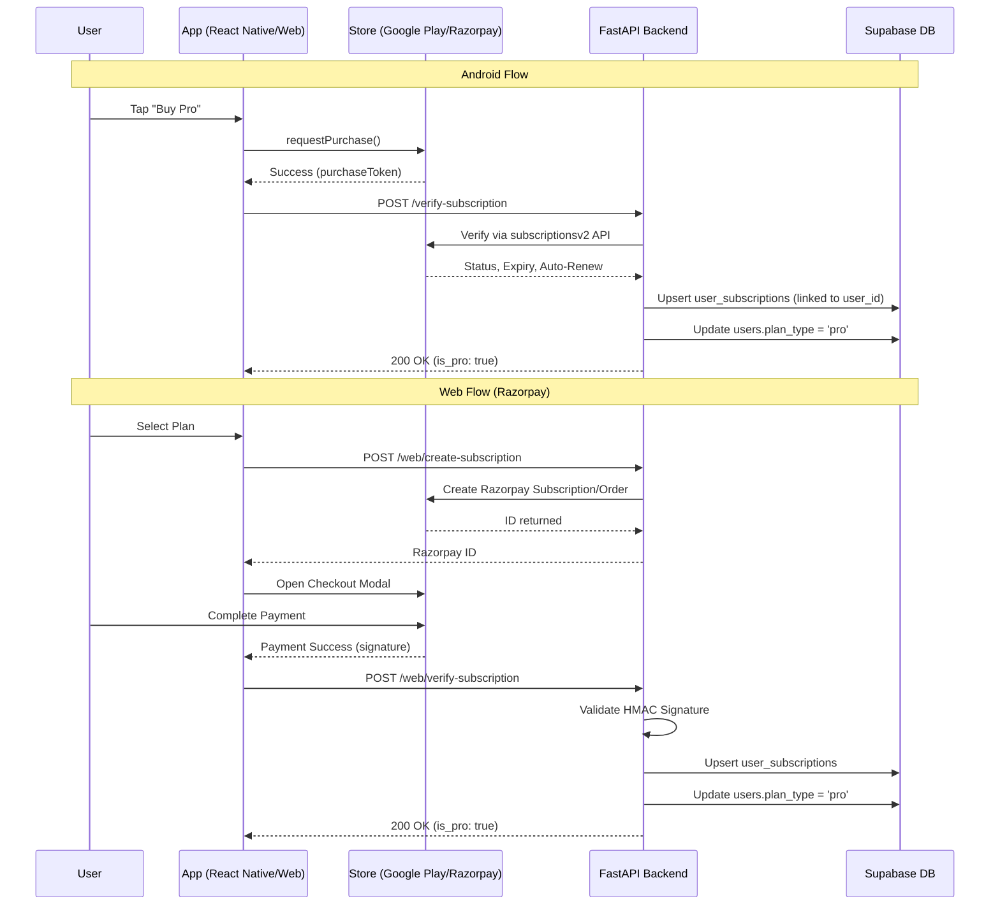

# Comprehensive Payment System Audit – PikaDecks

This report provides a detailed end-to-end audit of the entire payment architecture across the PikaDecks ecosystem, covering the React Native app, Web version, and FastAPI backend.

---

## 1. Payment Architecture Diagram



---

## 2. Frontend Payment Flow

### Android (Google Play)
- **Purchase Initiation:** Initiated in `billing.tsx` using `react-native-iap`. `purchaseSubscription()` invokes the native billing prompt.
- **Verification:** On success, `onPurchaseUpdated` listener triggers `verifyPurchaseWithBackend()`, sending the token to `/verify-subscription`.
- **Restoration:** On app startup or clicking "Restore", `restorePurchases()` calls `getAvailablePurchases()` and verifies the token.
- **State Management:** Stored in SecureStore (`SUBSCRIPTION_STATUS_KEY`) and fetched via React Query (`useSubscriptionStatus`).

### Web (Razorpay)
- **Checkout:** Initiates Razorpay checkout flow, receiving a payment signature.
- **Verification:** Calls `/web/verify-subscription` to validate the signature and activate Pro.

---

## 3. Backend Payment Lifecycle & Database

**Target Files:** `app/services/billing.py`, `app/routes/billing.py`

**Database Schema (Supabase):**
- `user_subscriptions`: Stores `purchase_token_sha256` (unique), `user_id`, `status`, `expires_at`, `platform`.
- `users`: Stores `plan_type` ('free' or 'pro').
- `billing_events`: Audit log for raw payloads.
- `processed_pubsub_messages`: Idempotency table for Google Play RTDN events.

**Flow:**
- `upsert_user_subscription` hashes the token (`hash_purchase_token`), verifies with Google Play, checks for multi-user conflicts, and saves to the DB.
- If successful, it triggers `update_user_plan_type` to activate premium features.

---

## 4. Identified Bugs & Inconsistencies (High Priority)

### Bug 1: "DB was not updated" / RTDN Webhook Orphaned Purchases
- **Issue:** If the app crashes or network fails *before* the frontend calls `/verify-subscription`, the backend receives the Google Play RTDN webhook. However, because the backend doesn't know the `user_id` mapping for this new token, it attempts to read `obfuscatedExternalAccountId` from Google. Since the frontend never sets this ID in `requestSubscription()`, the backend fails to map the user, logs `rtdn_unmatched_purchase_token`, and aborts. **The DB is not updated, and the user remains free.**
- **Impact:** Users are charged but do not receive Premium access if the verification API fails on the client.

### Bug 2: Incorrect Expiry Time Configuration
- **Issue:** The backend parses Google Play's `expiryTime` and stores it in the DB as a naive UTC string (e.g., `2023-12-14T01:54:30`) via `.isoformat()`, stripping the timezone `Z`. When the frontend reads this string into `new Date(isoString)`, JavaScript interprets it in the **user's local timezone**, causing the expiry date displayed in the UI to be shifted by several hours (e.g., in IST, it shifts by 5.5 hours backward).
- **Impact:** Confusing UI display for expiration dates, leading to support requests.

### Bug 3: Multi-User Device Conflict (409 Error)
- **Issue:** Google Play purchases are bound to the Google Account on the device, not the app account. If User A buys Pro, logs out, and User B logs in, Google Play reports the device owns Pro. When User B's app tries to verify or restore it, the backend sees the token is already linked to User A and throws a `409: This purchase token is already linked to another account`. The frontend surfaces this as an error toast, but leaves the user stuck.
- **Impact:** Expected security behavior, but poor UX. 

---

## 5. Security & Edge Cases Assessment

- **Signature Validation:** Secure. Razorpay uses HMAC-SHA256, and Google Play uses service accounts via official APIs.
- **Duplicate Protection:** Good. `purchase_token_sha256` is unique in `user_subscriptions`, preventing replay attacks. `processed_pubsub_messages` prevents duplicate RTDN processing.
- **Premium Refresh:** Fast. Status is cached via SecureStore and React Query with a 1-minute stale time.
- **Missing Edge Case:** Razorpay subscriptions created on Web do not have an equivalent native iOS/Android restore flow. A user buying on Web will get it on Android via the backend DB, but they cannot manage the subscription from the Google Play store.

---

## 6. Actionable Recommendations & Proposed Fixes

### Fix for Missing DB Updates (RTDN Orphan Recovery)
1. **Frontend Update:** In `billing.ts`, pass the user ID as the obfuscated account ID during purchase:
   ```typescript
   await iap.requestSubscription({
     sku: product.productId,
     obfuscatedAccountId: await getClerkUserId(), // Need to map this correctly
   })
   ```
2. **Backend Update:** Ensure the backend successfully parses this field to bind orphaned purchases to the correct user.

### Fix for Expiry Time Configuration
1. **Backend Update:** Ensure all datetimes returned to the frontend append `Z` to indicate UTC.
   ```python
   "expires_at": verified["expires_at"].isoformat() + "Z" if verified["expires_at"] else None,
   ```

### Fix for Multi-User Conflict (409 Error)
1. **Frontend Update:** Catch the 409 error specifically in `restorePurchases` and show a clear, user-friendly alert (e.g., "This Google Play purchase is linked to another PikaDecks account. Please log in with that account.") instead of a generic toast. Do not block normal app usage.

### Architecture Improvements
- Standardize the `platform` column strictly (currently it allows 'android', 'razorpay').
- Introduce a scheduled cron job (or serverless function) to periodically sweep active subscriptions and verify their status against Google Play, as RTDN webhooks can occasionally be dropped by GCP infrastructure.
