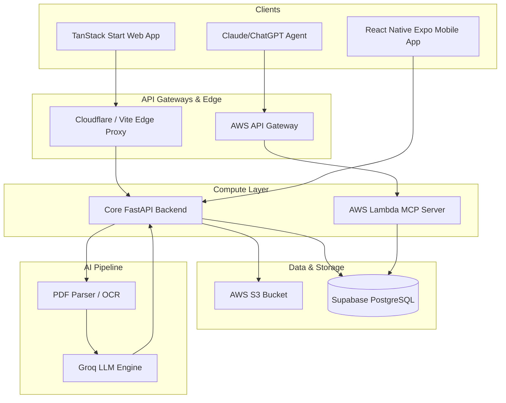

# 🏛️ PikaDecks Architecture & Data Flow

This document details the architectural layout, core systems, and data flow of the PikaDecks platform.

---

## 🏗️ System Overview

PikaDecks is built as a highly decoupled modern application ecosystem, integrating low-latency web engines, cross-platform mobile apps, and developer-accessible agentic interfaces.



---

## 🔄 Core Ingestion & Generation Pipeline

When a student or researcher uploads a PDF textbook to PikaDecks:

1. **Document Ingestion**:
   - The file is uploaded directly to **AWS S3** via pre-signed URLs generated by the **FastAPI core backend**.
   - A document record is initialized in **Supabase PostgreSQL** in a pending state.

2. **OCR & Extraction**:
   - The backend runs a fast PDF parser using `pypdf` to extract raw text and metadata.
   - Text is parsed page-by-page to preserve logical boundaries.

3. **Semantic Chunking**:
   - Extracted text is segmented into logical, self-contained semantic blocks based on header hierarchies and paragraph sizes.
   - This ensures the generative AI pipeline receives complete context windows.

4. **Dynamic Card Generation**:
   - The chunks are sent to the **Groq API** with system prompts designed to extract core facts, key definitions, and concept comparisons.
   - Groq returns structured JSON arrays containing proposed flashcards (Question, Answer, Context).
   - Cards are automatically saved to the database.

5. **Spaced Repetition Scheduling**:
   - The backend schedules card reviews using a Python-based implementation of the SuperMemo-2 algorithm (`srs.py`).
   - Cards receive difficulty weights (Easiness factor) and repetition intervals that determine when they will be presented next.

6. **Mobile Sync**:
   - The mobile application synchronizes offline state with Supabase upon launching, pulling scheduled cards to the device.

---

## 🔌 Model Context Protocol (MCP) Architecture

The PikaDecks MCP server allows AI developer agents (such as Claude Desktop or Cursor) to act as assistants in your learning workflows. It uses FastMCP as a lightweight interface:

```text
AI Client (e.g. Claude) ──[JSON-RPC over HTTP]──> Cloudflare Proxy ──> AWS Lambda (FastMCP) ──> Supabase DB
```

By separating the MCP server from the main core FastAPI backend, we ensure that developer agents cannot bypass safety controls, modify billing metrics, or access raw S3 storage directly. It serves exclusively as a secure read-only/connectivity-check interface.
